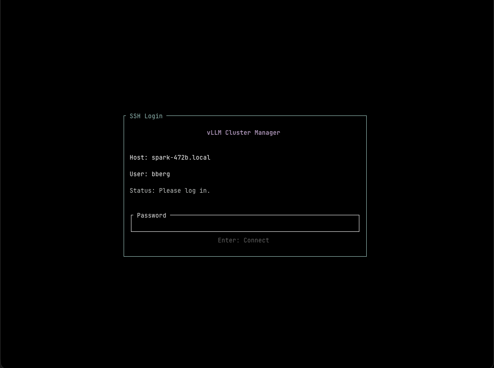
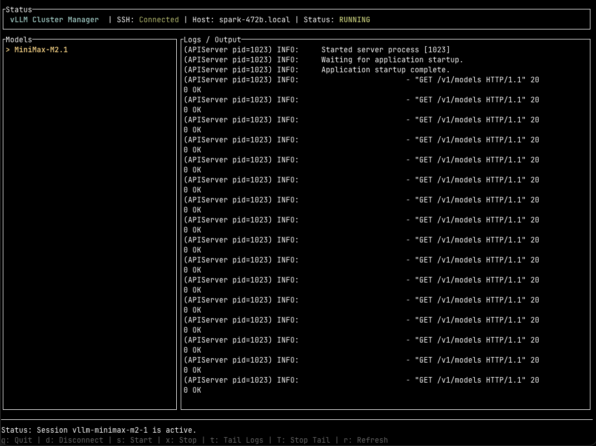

# VLLM Cluster TUI




A terminal-based user interface for managing a distributed vLLM cluster on DGX Spark nodes.

## Requirements

To use this tool, your cluster must meet the following requirements:

1.  **Hardware**: 2 DGX Spark nodes.
2.  **Software**: The [spark-vllm-docker](https://github.com/eugr/spark-vllm-docker) repository must be installed and configured on the head node.

## Setup

1.  **Clone the repository** (if applicable) or download the source.

2.  **Configuration**:
    *   Copy the template: `cp server.template.json server.json`
    *   Edit `server.json` with your cluster details (host, user, docker path, and list of nodes).
    *   Edit `models.json` to define the available models and their launch arguments.

3.  **Build**:
    *   **Local**: `cargo run --release`
    *   **Docker**:
        ```bash
        docker build -t vllm-tui .
        docker run -it --rm -v "$(pwd)/server.json:/app/server.json" -v "$HOME/.ssh:/root/.ssh:ro" vllm-tui
        ```

## Usage

| Key | Action |
| --- | --- |
| `d` | Disconnect |
| `s` | Start Cluster (with selected model) |
| `x` | Stop Cluster |
| `t` | Watch Logs (Tail) |
| `Shift+t` | Stop Watching Logs |
| `r` | Refresh Status |
| `q` | Quit |

## License

[MIT](LICENSE)
